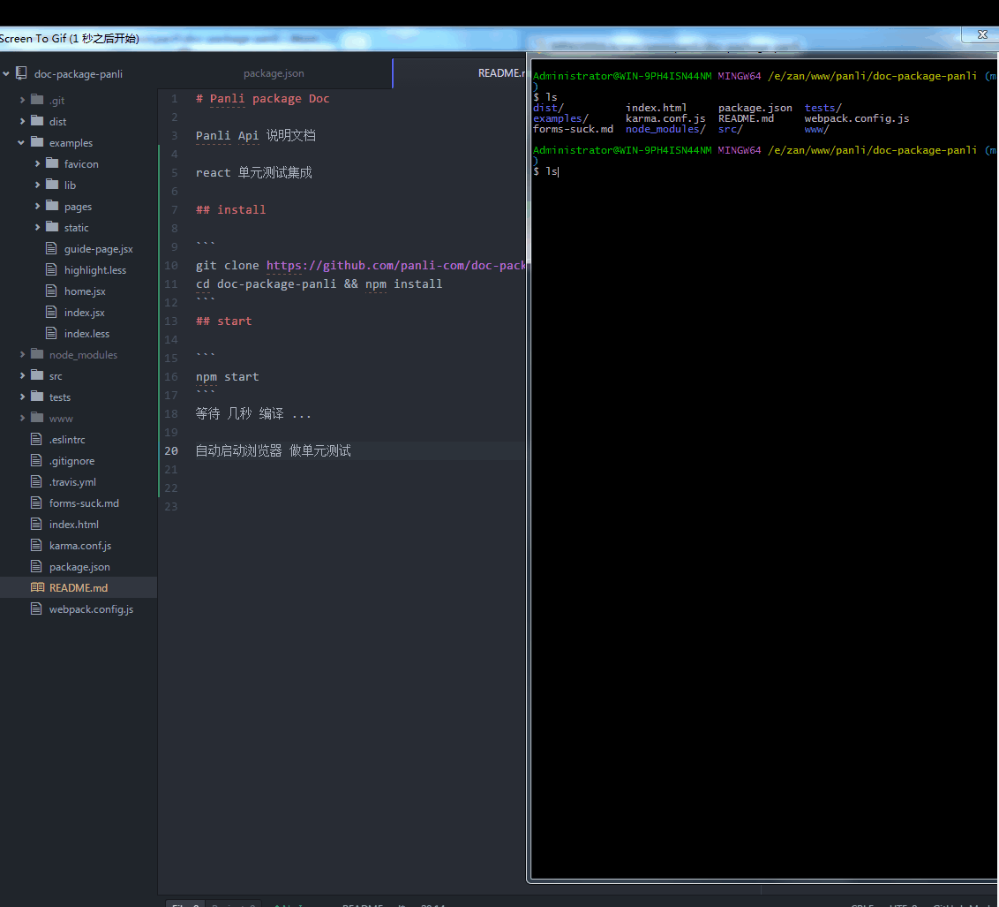

# Panli package Doc

Panli Api 说明文档

react 单元测试集成

## install

```
git clone https://github.com/panli-com/doc-package-panli.git
cd doc-package-panli && npm install
```
## start

```
npm start
```
等待 几秒 编译 ...

自动启动浏览器 做单元测试


